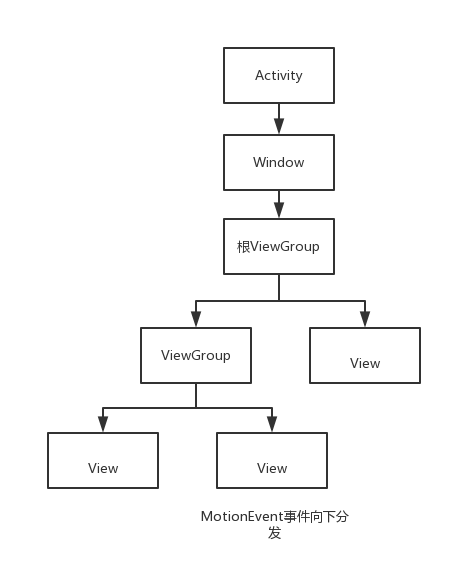
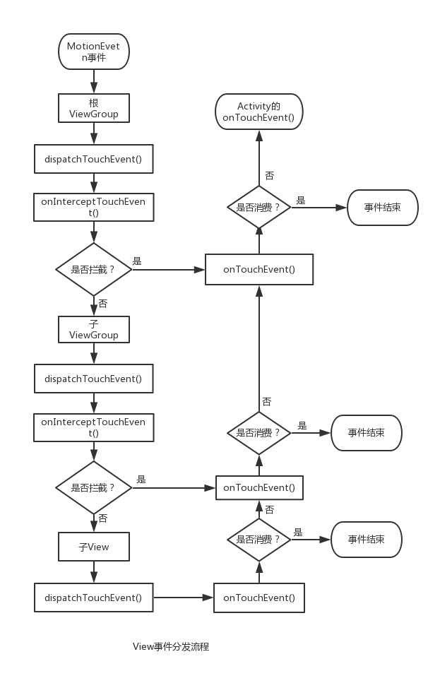

### Android View事件的分发机制
#### 1. MotionEvent事件
我们对屏幕的点击，滑动，抬起等一系列的动作，其实都是由一个一个的MotionEvent事件组成的。这些MotionEvent事件主要有三个类型:  
1. ACTION\_DOWN: 手指触摸屏幕，按下去的一瞬间产生该事件  
2. ACTION\_MOVE: 手指在屏幕上滑动时产生该事件  
3. ACTION\_UP: 手指从屏幕抬起时产生该事件  
从ACTION\_DOWN到ACTION\_UP事件的结束我们称之为一个事件序列

正常情况下，我们在屏幕上的一系列操作，可以总结为如下两种：  
1. 点击以后抬起：ACTION\_DOWN -> ACTION\_UP  
2. 点击以后，滑动，最后抬起：ACTION\_DOWN -> n 个  ACTION\_MOVE -> ACTION\_UP  

### 2. MotionEvent事件的分发
所谓事件的分发，其实就是对MotionEvent事件的分发，当一个MotionEvent事件产生以后，系统需要把他传递给一个具体的View。而这个传递的过程就是分发过程  
而分发的过程主要涉及到View的三个重要函数  

> 1. public boolean dispatchTouchEvent(MotionEvent event)  
> 用来进行事件的分发，当一个MotionEvent传递给了View，那么此方法一定会被调用  
> **返回值表示是否消费了该事件，可能是View本身的onTouchEvent方法消耗了该事件，也可能是子View的dispatchTouchEvent方法中消费了。返回true表示事件被消费了，本次事件终止，返回false表示View以及子View均没有消费事件，将调用父View的onTouchEvent方法**
> 2. public boolean onInterceptTouchEvent(MotionEvent ev)  
> 用于事件的拦截，在dispatchTouchEvent方法中调用，返回结果表示是否拦截当前事件。**ViewGroup特有的方法，View没有该方法。  
> 返回值：是否拦截事件传递，返回true表示拦截了事件，那么事件将不再向下分发而是调用View本身的onTouchEvent方法。返回false表示不做拦截，事件将向下分发到子View的dispatchTouchEvent方法。**
> 3. public boolean onTouchEvent(MotionEvent ev)  
> 真正对MotionEvent进行处理或者说消费的方法。在dispatchTouchEvent进行调用。  
> **返回值：返回true表示事件被消费，本次的事件终止。返回false表示事件没有被消费，将调用父View的onTouchEvent方法**

**我们可以通过个具体的例子来初步了解一下事件的分发机制**  

假设我们有一个ViewGroup包含了一个View。这时候我们在View上面滑动，产生了一系列的MotionEvent事件，MotionEvent事件首先传递给了ViewGroup。这时候View的dispatchTouchEvent事件就会被调用。在ViewGroup的dispatchTouchEvent方法中，首先通过调用onInterceptTouchEvent方法来判断是否要拦截该事件（ViewGroup的onInterceptTouchEvent默认返回false。表示不拦截事件）如果该事件被ViewGroup拦截了。那么ViewGroup的onToucheEvent事件就会被调用。如果ViewGroup不拦截该事件，那么该事件就会被传递给他的子View。在本例中，就是这上文提到的ViewGroup包含的这个View。子View的dispatchTouchEvent方法就会被调用。 
 
**下面我们用一段伪代码来描述一下**  

```
    public boolean dispatchTouchEvent(MotionEvent ev) {
        boolean consume = false;//事件是否被消费
        if (onInterceptTouchEvent(ev)){//调用onInterceptTouchEvent判断是否拦截事件
            consume = onTouchEvent(ev);//如果拦截则调用自身的onTouchEvent方法
        }else{
            consume = child.dispatchTouchEvent(ev);//不拦截调用子View的dispatchTouchEvent方法
        }
        return consume;//返回值表示事件是否被消费，true事件终止，false调用父View的onTouchEvent方法
    }

```
**上面我们提到了ViewGroup的onInterceptTouchEvent默认返回false。那View呢。他们的dispatchTouchEvent方法是一样的吗？**  

我们都知道ViewGroup是View的子类，也就是说ViewGroup本身就是一个View，但是它可以包含子View（当然子View也可能是一个ViewGroup），所以不难理解，上面所展示的伪代码表示的是ViewGroup 处理事件分发的流程。而View本身是不存在分发(这不代表他没有dispatchTouchEvent方法，只是他不会像ViewGroup那样进行分发)，所以也没有拦截方法（onInterceptTouchEvent），它只能消费或者不消费。  

**我们通过几个流程图来更加清晰地认识下**  
  



### 3. View事件分发源码解析
#### 点击事件最先传递到Activity，由Acivity的dispatchTouchEvent方法来对事件进行分发

```
Class Activity：
    public boolean dispatchTouchEvent(MotionEvent ev) {
        if (ev.getAction() == MotionEvent.ACTION_DOWN) {
            onUserInteraction();
        }
        if (getWindow().superDispatchTouchEvent(ev)) {//事件分发并返回结果
            return true;//事件被消费
        }
        return onTouchEvent(ev);//没有View可以处理，调用Activity onTouchEvent方法
    }
```
可以看到事件交给Activity所属的window进行分发，如果返回的是true。那么整个循环事件就结束了，否则调用Activity的onTouchEvent事件。由于Window的唯一实现是phoneWindow。那我们来看一下phoneWindow的superDispatchTouchEvent

```
class PhoneWindow
    // This is the top-level view of the window, containing the window decor.
    private DecorView mDecor;
    public boolean superDispatchTouchEvent(MotionEvent event) {
        return mDecor.superDispatchTouchEvent(event);
    }
```
调用的是mDecor的superDispatchTouchEven。而mDecor是DecorView。
(这个DecorView就是Window的顶级View，我们通过setContentView设置的View是它的子View) ，而它也是个ViewGroup。所以我们最终调用的是ViewGroup的dispatchTouchEvent
#### ViewGroup的dispatchTouchEvent方法

```
class ViewGroup:
    public boolean dispatchTouchEvent(MotionEvent ev) {
        ...
        final int action = ev.getAction();
        final int actionMasked = action & MotionEvent.ACTION_MASK;
        // Handle an initial down.
        if (actionMasked == MotionEvent.ACTION_DOWN) {
            // Throw away all previous state when starting a new touch gesture.
            // The framework may have dropped the up or cancel event for the previous gesture
            // due to an app switch, ANR, or some other state change.
            cancelAndClearTouchTargets(ev);
            resetTouchState();//清除FLAG_DISALLOW_INTERCEPT设置，并且mFirstTouchTarget 设置为null
        }
        // Check for interception.
        final boolean intercepted;//是否拦截事件
        if (actionMasked == MotionEvent.ACTION_DOWN
                || mFirstTouchTarget != null) {
            //FLAG_DISALLOW_INTERCEPT是子类通过requestDisallowInterceptTouchEvent方法进行设置的
            final boolean disallowIntercept = (mGroupFlags & FLAG_DISALLOW_INTERCEPT) != 0;
            if (!disallowIntercept) {
                //调用onInterceptTouchEvent方法判断是否需要拦截
                intercepted = onInterceptTouchEvent(ev);
                ev.setAction(action); // restore action in case it was changed
            } else {
                intercepted = false;
            }
        } else {
            // There are no touch targets and this action is not an initial down
            // so this view group continues to intercept touches.
            intercepted = true;
        }
        ...
    }
```
**一开始可能不知道从何看起，那么我们先从下面的知识点开始探究**   
**1. 子View可以通过requestDisallowInterceptTouchEvent方法干预父View的事件分发过程（ACTION_DOWN事件除外）**  

先看下面这段代码

```
// Check for interception.
        final boolean intercepted;//是否拦截事件
        if (actionMasked == MotionEvent.ACTION_DOWN
                || mFirstTouchTarget != null) {
            //FLAG_DISALLOW_INTERCEPT是子类通过requestDisallowInterceptTouchEvent方法进行设置的
            final boolean disallowIntercept = (mGroupFlags & FLAG_DISALLOW_INTERCEPT) != 0;
            if (!disallowIntercept) {
                //调用onInterceptTouchEvent方法判断是否需要拦截
                intercepted = onInterceptTouchEvent(ev);
                ev.setAction(action); // restore action in case it was changed
            } else {
                intercepted = false;
            }
        } else {
            // There are no touch targets and this action is not an initial down
            // so this view group continues to intercept touches.
            intercepted = true;
        }
```
首先说明子View可以通过调用requestDisallowInterceptTouchEvent方法设置FLAG\_DISALLOW\_INTERCEPT标识。来使disallowIntercept为true。
那为什么子View无法拦截ACTION_DOWN事件呢，因为最上面的这一段代码

```
cancelAndClearTouchTargets(ev);
resetTouchState();//清除FLAG_DISALLOW_INTERCEPT设置，并且mFirstTouchTarget 设置为null
```
这样清除了FLAG\_DISALLOW\_INTERCEPT字段的设置，并将mFirstTouchTarget字段置为空。这样的话disallowIntercept字段就会被置为false。从而调用ViewGroup的onInterceptTouchEvent方法判断是否需要拦截。所以无法拦截ACTION_DOWN事件  

**再探究第二个知识点**  
**2. ViewGroup默认不拦截任何事件，所以事件能正常分发到子View处（如果子View符合条件的话），如果没有合适的子View或者子View不消耗ACTION_DOWN事件，那么接着事件会交由ViewGroup处理，并且同一事件序列之后的事件不会再分发给子View。并且不再调用他的onInterceptTouchEvent。（所以onInterceptTouchEvent并非每次都会被调用。如果要处理所有的点击事件那么需要选择dispatchTouchEvent方法）**  

*先说明一下mFirstTouchTarget这个字段，我们可以先这么理解，如果事件由子View去处理时mFirstTouchTarget 会被赋值并指向子View。
那么如果ViewGroup决定拦截事件，那么mFirstTouchTarget就会为空。*  

这个知识点的具体解释如下：  
1. 因为子View无法拦截ACTION\_DOWN。那么在ACTION_DOWN时候会调用ViewGroup的
onInterceptTouchEvent。ViewGroup如果决定拦截，那么该方法就会返回true。那么intercepted就为true。  
2. 接下来看得出intercepted值以后的代码

```
 ...//省略canceled字段的逻辑，这里不考虑
 if (!canceled && !intercepted) {
 	...//遍历子View相关逻辑
 }
 if (mFirstTouchTarget == null) {
    // No touch targets so treat this as an ordinary view.
    handled = dispatchTransformedTouchEvent(ev, canceled, null,TouchTarget.ALL_POINTER_IDS);
 } else {
     ...       
 } 
```
因为 intercepted为true。所以不执行遍历子View相关的逻辑。而且mFirstTouchTarget为空，所以执行dispatchTransformedTouchEvent方法
dispatchTransformedTouchEvent方法的重点是下面这一段代码

```
if (child == null) {
	handled = super.dispatchTouchEvent(event);
} else {
   handled = child.dispatchTouchEvent(event);
}
```
执行dispatchTransformedTouchEvent传入的第三个参数就是child。可以看到我们传入的是null。所以执行super.dispatchTouchEvent(event)。也就是View的dispatchTouchEvent（因为ViewGroup的父类是View）
3. 接下来，当ACTION\_MOVE以及ACTION\_UP事件到来的时候，此时

```
if(actionMasked == MotionEvent.ACTION_DOWN
                || mFirstTouchTarget != null)
```
这个判断为false。那么一定执行else

```
else {
            // There are no touch targets and this action is not an initial down
            // so this view group continues to intercept touches.
            intercepted = true;
        }
```
将intercepted置为true。（这里可以看到ViewGroup的onInterceptTouchEvent就不会被调用了）  
然后因为mFirstTouchTarget的赋值在遍历子View的循环里面，intercepted为true的时候不执行，所以一直为null。所以还是会按照2的步骤去执行，最终执行View的dispatchTouchEvent。（默认情况下，最终会执行ViewGroup的onTouchEvent方法。具体等到后面分析View的dispatchTouchEvent方法的时候再说）  

**接下来在看第三个知识点**  
**如果某一个子View拦截了事件，而且不干扰父View拦截事件，那么父View可以在某个ACTION的时候进行拦截，拦截了以后该事件就由ViewGroup处理**  

ACTION\_DOWN的时候，子View无法拦截该事件。这时候ViewGroup如果不拦截事件，那么会去遍历子View，如果有子View拦截了该事件，那么mFirstTouchTarget就不为空，那么当下次的ACTION\_MOVE以及ACTION\_UP事件到来的时候，因为mFirstTouchTarget不为空，所以会进入拦截判断，调用onInterceptTouchEvent来判断是否要返回。  

**当ViewGroup不拦截事件，那么事件将下发给子View进行处理。**  

```
class ViewGroup:
    public boolean dispatchTouchEvent(MotionEvent ev) {
        final View[] children = mChildren;
        //对子View进行遍历
        for (int i = childrenCount - 1; i >= 0; i--) {
            final int childIndex = getAndVerifyPreorderedIndex(
                    childrenCount, i, customOrder);
            final View child = getAndVerifyPreorderedView(
                    preorderedList, children, childIndex);
 
            // If there is a view that has accessibility focus we want it
            // to get the event first and if not handled we will perform a
            // normal dispatch. We may do a double iteration but this is
            // safer given the timeframe.
            if (childWithAccessibilityFocus != null) {
                if (childWithAccessibilityFocus != child) {
                    continue;
                }
                childWithAccessibilityFocus = null;
                i = childrenCount - 1;
            }
 
            //判断1，View可见并且没有播放动画。2，点击事件的坐标落在View的范围内
            //如果上述两个条件有一项不满足则continue继续循环下一个View
            if (!canViewReceivePointerEvents(child)
                    || !isTransformedTouchPointInView(x, y, child, null)) {
                ev.setTargetAccessibilityFocus(false);
                continue;
            }
 
            newTouchTarget = getTouchTarget(child);
            //如果有子View处理即newTouchTarget 不为null则跳出循环。
            if (newTouchTarget != null) {
                // Child is already receiving touch within its bounds.
                // Give it the new pointer in addition to the ones it is handling.
                newTouchTarget.pointerIdBits |= idBitsToAssign;
                break;
            }
 
            resetCancelNextUpFlag(child);
            //dispatchTransformedTouchEvent第三个参数child这里不为null
            //实际调用的是child的dispatchTouchEvent方法
            if (dispatchTransformedTouchEvent(ev, false, child, idBitsToAssign)) {
                // Child wants to receive touch within its bounds.
                mLastTouchDownTime = ev.getDownTime();
                if (preorderedList != null) {
                    // childIndex points into presorted list, find original index
                    for (int j = 0; j < childrenCount; j++) {
                        if (children[childIndex] == mChildren[j]) {
                            mLastTouchDownIndex = j;
                            break;
                        }
                    }
                } else {
                    mLastTouchDownIndex = childIndex;
                }
                mLastTouchDownX = ev.getX();
                mLastTouchDownY = ev.getY();
                //当child处理了点击事件，那么会设置mFirstTouchTarget 在addTouchTarget被赋值
                newTouchTarget = addTouchTarget(child, idBitsToAssign);
                alreadyDispatchedToNewTouchTarget = true;
                //子View处理了事件，然后就跳出了for循环
                break;
            }
        }
    }
```
分发过程首先需要遍历ViewGroup的所有子View，可以接收点击事件的View需要满足下面条件:  
1. 如果View可见并且没有播放动画，通过canViewReceivePointerEvents方法判断
2. 点击事件的坐标落在View的范围内，通过isTransformedTouchPointInView方法判断  
如果满足上面两个条件，接着我们看后面的代码newTouchTarget = getTouchTarget(child)

```
    /**
     * Gets the touch target for specified child view.
     * Returns null if not found.
     */
    private TouchTarget getTouchTarget(@NonNull View child) {
        for (TouchTarget target = mFirstTouchTarget; target != null; target = target.next) {
            if (target.child == child) {
                return target;
            }
        }
        return null;
    }
```
可以看到当mFirstTouchTarget不为null的时候并且target.child就为我们当前遍历的child的时候，那么返回的newTouchTarget 就不为null，则跳出循环。我们前面说过，当子View处理了点击事件那么mFirstTouchTarget就不为null。事实上此时我们还没有将事件分发给子View，所以正常情况下我们的newTouchTarget此时为null

接下来调用了
dispatchTransformedTouchEvent(ev, false, child, idBitsToAssign)  
可以看到它被最后一个if包围，如果它返回为true，那么就break跳出循环，如果返回为false则继续遍历下一个子View
而dispatchTransformedTouchEvent方法我们在上面有展示过，根据传入的child是否为空来执行不同的操作。我们遍历传入的子View此时不为null，则调用了child.dispatchTouchEvent(event)  

我们子View的dispatchTouchEvent方法返回true，表示子View处理了事件。那么我们一直提到的，mFirstTouchTarget 会被赋值，是在哪里完成的呢？
再回头看dispatchTransformedTouchEvent为true进入最后一个if语句，有这么一句newTouchTarget = addTouchTarget(child, idBitsToAssign)  

```
    /**
     * Adds a touch target for specified child to the beginning of the list.
     * Assumes the target child is not already present.
     */
    private TouchTarget addTouchTarget(@NonNull View child, int pointerIdBits) {
        final TouchTarget target = TouchTarget.obtain(child, pointerIdBits);
        target.next = mFirstTouchTarget;
        mFirstTouchTarget = target;
        return target;
    }
```
mFirstTouchTarget就是在addTouchTarget中被赋值的，到此子View遍历结束。
  
如果在遍历完子View以后ViewGroup仍然没有找到事件处理者即ViewGroup并没有子View或者子View处理了事件，但是子View的dispatchTouchEvent返回了false（一般是子View的onTouchEvent方法返回false）那么ViewGroup会去处理这个事件。
从代码上看就是我们遍历的dispatchTransformedTouchEvent方法返回了false。那么mFirstTouchTarget 必然为null；
在ViewGroup的dispatchTouchEvent遍历完子View后的处理我们在上面也提到了。
最终ViewGroup会执行super.dispatchTouchEvent(event)也就是View的dispatchTouchEvent方法。所以我们有必要来探究一下View的dispatchTouchEvent方法了

#### View的dispatchTouchEvent方法

```
class View:
    public boolean dispatchTouchEvent(MotionEvent event) {
    if (mOnTouchListener != null && (mViewFlags & ENABLED_MASK) == ENABLED &&
            mOnTouchListener.onTouch(this, event)) {
        return true;
    }
    return onTouchEvent(event);
}
```
因为新版的方法比较复杂。这里我翻了别的文章，找到了以前版本的View的dispatchTouchEvent。简洁明了。和新版的方法原理都是一样的。

**下面我们来分析源码**  
首先判断如果onTouchListener被设置了，而且View是enable的，而且onTouchListener返回了true。那么会直接返回true。否则就会调用View的onTouchEvent事件。这说明给view设置onTouchListenr优先级比View的onTouchEvent事件的优先级高。那onClick事件呢，onClick事件在onTouchEvent事件里面。所以onClick事件比onTouch事件优先级低，如果onTouch事件返回了true。就不会执行onClick事件。而这里需要提一下onClick事件，在onTouchEvent方法里面，首先需要View是clickable的，然后在action_up的时候，只要onClickListener不为空，那么就会执行点击事件。默认情况下，button是clickable的，而textView是不可点击的。那么为什么我们通常开发中直接对textView设置点击事件，他会被执行呢。原因就在setOnClick方法的时候，会将view的clickable设置为true。

至此，MotionEvent事件分发机制与源码的分析已经讲完了。大家记得多根据源码去进行分析。将源码的步骤记在心里，才能在各种场景下融会贯通事件分发的知识点。


